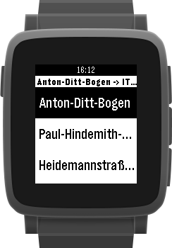

# pebble-pendelbus

This app shows the schedule for the BMW transit bus in Munich.

## Road map

The following features are in the development pipe line:

- **Prototype**
  - [x] Basic data structure and path finding algorithm
  - [x] Pebble app showing result

- Version 1.0
  - [ ] User can select start and destination
  - [x] Data generation based on ~~Excel~~ CSV
  - [ ] Take departure/arrival times into account
  - [ ] App icon
  - [ ] App available via Pebble market

- Version 2.0
  - [ ] Suggestion of nearest bus stop based on GPS
  - [ ] Online timetable update
  - [ ] Pins on Pebble timeline

- Version 3.0
  - [ ] Animations

